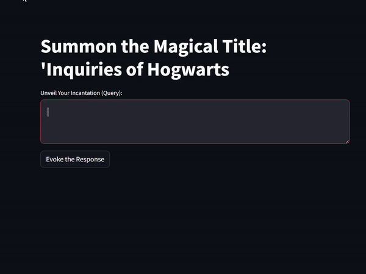

# Langchain-based Retrieval-Augmented Generation

**Langchain-based Retrieval-Augmented Generation** is an interactive Question-Answering (Q&A) system powered by Langchain, a language processing library. It leverages retrieval-augmented generation techniques to provide accurate and contextually relevant responses to user queries.

## Features

- **Retrieval-Augmented Generation:** Utilizes Langchain's advanced algorithms to retrieve and generate responses based on contextual understanding.
- **Streamlit Interface:** Offers an intuitive user interface powered by Streamlit, allowing users to input queries and receive responses in real-time.
- **Customizable:** Easily customizable to accommodate different datasets and adapt to specific use cases.

## Trained on Harry Potter Books Dataset ⚡🧙

This Q&A system has been trained on a dataset consisting of the Harry Potter book series to provide responses related to the magical world of Harry Potter.

## Installation

1. Clone the repository to your local machine:

git clone https://github.com/your_username/langchain-retrieval-augmented-generation.git

2. Navigate to the project directory:

cd langchain-retrieval-augmented-generation

3. Install the necessary dependencies:

pip install -r requirements.txt

## Usage

1. Run the Streamlit app:

streamlit run app.py

2. Open your web browser and go to `http://localhost:8501` to access the Streamlit interface.

3. Enter your query in the provided text area and click "Get Response" to receive a response based on Langchain's retrieval-augmented generation.

## Sample

This is How it Looks like!

## Contributing

Contributions to enhance the functionality and usability of the Q&A system are welcome! Please fork the repository, make your changes, and submit a pull request with a detailed description of your contribution.

## License

This project is licensed under the [MIT License](LICENSE).
